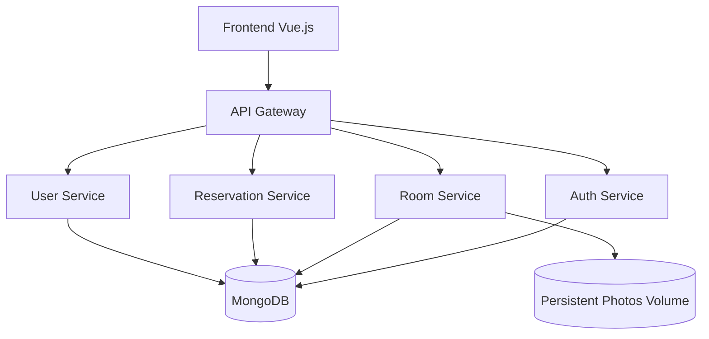

# Study Room Booking System

**Service-Based Web Application**  
**Author:** Pattharamon Dumrongkittikule 6610545472

---

## Table of Contents
1. [Introduction](#1-introduction)
2. [System Architecture](#2-system-architecture)
3. [Core Features & Roles](#3-core-features--roles)
4. [Key Technical Highlights](#4-key-technical-highlights)
5. [Technology Stack](#5-technology-stack)
6. [How to Run the App](#6-how-to-run-the-app)
7. [How to Run the Tests](#7-how-to-run-the-tests)
8. [Future Roadmap](#8-future-roadmap)

---

## 1. Introduction

The Study Room Booking System is a modular web application designed to streamline the process of reserving study spaces. It replaces manual booking methods with a robust digital platform, ensuring transparency, preventing double-bookings, and optimizing resource usage within educational buildings.

The system is built using a Service-Based Architecture, ensuring high scalability, maintainability, and clear separation of concerns.

---

## 2. System Architecture

The application is composed of independent services communicating behind a central API Gateway.



- **API Gateway**: Single entry point. Routes requests and handles inter-service proxying.
- **Auth Service**: Manages JWT authentication and registration.
- **Room Service**: CRUD for rooms and persistent photo management.
- **Reservation Service**: Handles booking logic and conflict prevention.
- **User Service**: Administrative user management and role assignment.

---

## 3. Core Features & Roles

### Member
- **Browse**: Explore available study rooms with live capacity tracking.
- **Reserve**: Book 1-hour slots for a specific group size.
- **Manage**: View personal booking history and cancel upcoming slots.

### Staff
- **Resource Control**: Add, update, or delete study rooms.
- **Availability**: Manage room status (Available, Maintenance, Closed).
- **Monitoring**: View all reservation records across the system.

### Administrator
- **Identity Management**: Full CRUD operations on user accounts.
- **System Oversight**: Oversee all rooms, reservations, and user roles.

---

## 4. Key Technical Highlights

- **Persistent Storage**: Utilizes Docker volumes for both MongoDB data and uploaded room photos.
- **Conflict Prevention**: Intelligent logic ensures rooms are never over-booked beyond their capacity.
- **Rich UI**: A premium rich purple interface with glassmorphism effects and responsive layouts.
- **Secure Auth**: JWT-based authentication ensures data privacy and role enforcement.

---

## 5. Technology Stack

- **Frontend**: Vue.js 3, Tailwind CSS
- **Backend**: FastAPI (Python)
- **Database**: MongoDB
- **DevOps**: Docker & Docker Compose
- **Utilities**: Day.js, HTTPX

---

## 6. How to Run the App

### Prerequisites
- [Docker Desktop](https://www.docker.com/products/docker-desktop/) installed and running.

### Launch Steps
1.  **Clone the project**:
    ```bash
    git clone https://github.com/Pat-7-626/Study-Room-Booking-System.git
    cd Study-Room-Booking-System
    ```

2.  **Start all services**:
    ```bash
    docker-compose up -d --build
    ```

3.  **Access the application**:
    - **Frontend (Web UI)**: `http://localhost:5173`
    - **Backend (API Gateway)**: `http://localhost:8000`

### Default Sign-in Credentials
| Role       | Email                | Password    |
| :--------- | :------------------- | :---------- |
| **Admin**  | `admin@example.com`  | `admin123`  |
| **Staff**  | `staff@example.com`  | `staff123`  |
| **Member** | `member@example.com` | `member123` |

---

## 7. How to Run the Tests
The system includes a comprehensive automated integration test suite that verifies **12 critical scenarios** across all roles and security layers.

### Steps to Run Tests
1. **Verify the app is running**:
   ```bash
   docker-compose ps
   ```
2. **Setup the test environment**:
   ```bash
   pip install -r tests/requirements-test.txt
   ```
3. **Execute the automated suite**:
   ```bash
   pytest -v tests/integration_test.py
   ```

### What is verified?
- **Authentication**: Secure registration and Login flows for all access tiers.
- **Room Management**: Full lifecycle (Create/Update/Delete) by **Staff** and **Administrators**.
- **User Management**: Role assignment and account control by **Administrators**.
- **Booking Flow**: Validated reservations with immediate `res_id` tracking for the client.
- **Security Isolation**: Guaranteed isolation—**Members** can manage their own records but are strictly blocked from accessing or deleting other users' reservations.
- **Capacity Enforcement**: Real-time logic to block bookings that exceed a room's physical capacity limit.

---

## 8. Future Roadmap

- [ ] Calendar-based UI for intuitive slot selection.
- [ ] Real-time vacancy updates via WebSockets.
- [ ] Automated email/push notifications for booking reminders.
- [ ] Analytics dashboard for room usage statistics.
