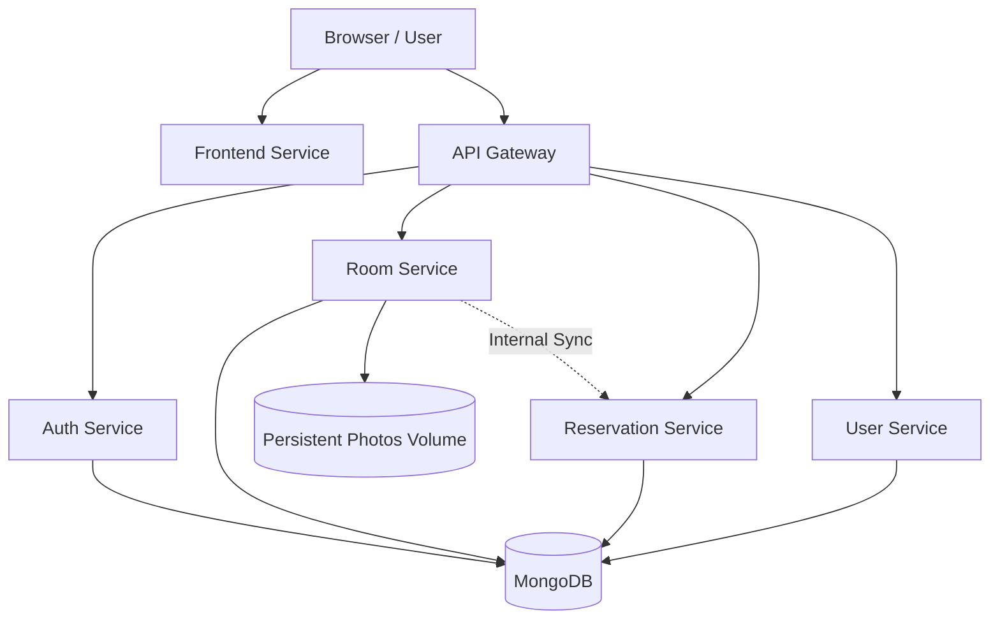

# Study Room Booking System

**Fully Containerized Service-Based Web Application**  
**Author:** Pattharamon Dumrongkittikule 6610545472

---

## 1. Introduction

The Study Room Booking System is a web-based application designed to allow users to efficiently reserve study rooms within a building. The system replaces manual or informal booking methods with a structured digital platform, improving reliability and accessibility.

Built using a **Service-Based Architecture**, the system ensures high scalability, modularity, and maintainability.

## 2. Background & Problem

In many universities, study room reservations are handled manually or through informal communication methods (paper logs, messaging). This leads to:

- Double booking of rooms
- Lack of transparency in availability
- Inefficient use of study rooms
- Difficulty in tracking reservations

This system addresses these problems by ensuring fair access, preventing conflicts, and providing a centralized platform for better resource utilization.

## 3. Objectives

- **Develop an online platform** for efficient study room reservations.
- **Enable staff and administrators** to manage room availability dynamically.
- **Implement role-based access control** to secure system operations.

## 4. Scope

- **Included**: User authentication, Room browsing/availability, Online reservation system, Role-based control.
- **Not Included**: Payment processing, physical door access control.

## 5. Target Users & Roles

- **Member**: Browse rooms, check live availability, create reservations, cancel personal records.
- **Staff**: Manage room information (Add/Update/Delete), view all system-wide reservation records.
- **Administrator**: Full user management (Create/Update/Delete), oversee all rooms and reservations (Create/Update/Delete).

## 6. System Architecture (Service-Based)

The application is composed of independent services communicating behind a central API Gateway.



- **Frontend**: Vue.js 3 interface served via Nginx.
- **API Gateway**: Single entry point routing requests to backend services.
- **Auth Service**: Handles JWT-based identity and registration.
- **User Service**: Manages user data and Admin operations.
- **Room Service**: Manages rooms, photo uploads, and operational status.
- **Reservation Service**: Handles booking logic and **Conflict Prevention** (Capacity summing).

## 7. Technology Stack

- **Frontend**: Vue.js, Tailwind CSS, Day.js
- **Backend**: FastAPI (Python), HTTPX
- **Database**: MongoDB
- **Containerization**: Docker & Docker Compose
- **Security**: JWT (Authentication), Bcrypt (Password Hashing)

## 8. Security & Access Control

- **JWT-based authentication** ensures that tokens carry role identity.
- **Role-based authorization** protects backend endpoints (e.g., Staff-only room management).
- **Security Isolation**: Members can only manage their own reservations; Staff/Admins have oversight of all records.

## 9. Key Technical Highlights

- **Intelligent Conflict Prevention**: Logic sums `group_size` across all bookings in a specific 1-hour slot and blocks bookings exceeding the room's capacity.
- **Persistence**: Uses Docker volumes for MongoDB data and uploaded room photos.
- **Aesthetic Excellence**: A premium "Rich Purple" interface with glassmorphism and responsive design.

## 10. How to Run the App

The entire system is orchestrated via Docker.

1. **Launch the stack**:
   ```bash
   docker-compose up -d --build
   ```
2. **Access the application**:
   - **Frontend UI**: `http://localhost:5173`
   - **API Gateway Docs**: `http://localhost:8000/docs`

### Default Credentials

| Role       | Email                | Password    |
| :--------- | :------------------- | :---------- |
| **Admin**  | `admin@example.com`  | `admin123`  |
| **Staff**  | `staff@example.com`  | `staff123`  |
| **Member** | `member@example.com` | `member123` |

## 11. How to Run the Tests

Verify the system with the automated integration suite (12 scenarios):

```bash
pip install -r tests/requirements-test.txt
pytest -v tests/integration_test.py
```

## 12. Limitations & Future Improvements

- **Limitations**: No physical access control, requires internet connection.
- **Future Improvements**:
  - Implement real-time updates via WebSockets.
  - Add an analytics dashboard for room usage statistics.

## 13. Conclusion

The Study Room Booking System provides a structured and efficient solution to reservation problems in educational institutions. By using a service-based architecture, the system ensures scalability, flexibility, and a premium user experience while preventing booking conflicts.
